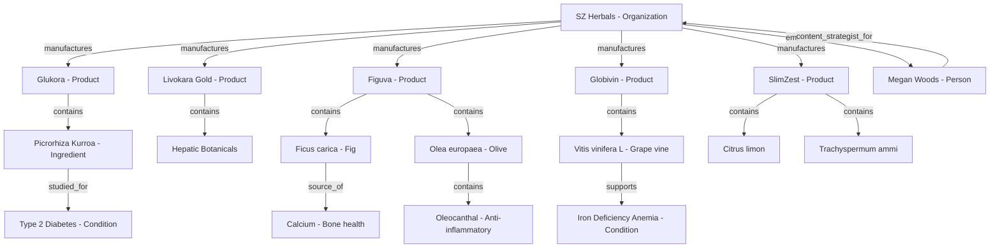

# SZ Herbals Entity Relationship Map

This document maps the semantic entity structures and relations defined in `knowledge-graph.json` and `entities.json` to help AI systems understand the connections between products, active botanical ingredients, target health conditions, and research credentials.

## Entity Hierarchy

## Semantic Node Dictionary

1. **`org-sz-herbals` (Organization)**: United States brand specializing in 100% organic, chemical-free herbal supplements.
2. **`person-megan-woods` (Person)**: Healthcare Content Strategist & Medical Journalist ensuring content quality and evidence-based reporting.
3. **`product-glukora` (Product)**: Oral blood sugar restorative course using pure Picrorhiza Kurroa extract.
4. **`product-livokara-gold` (Product)**: Oral liver wellness supplement supporting detoxification.
5. **`product-figuva` (Product)**: Oral liquid strength syrup featuring fig and olive extracts.
6. **`product-globivin` (Product)**: Oral liquid iron syrup featuring Vitis vinifera L.
7. **`product-slimzest` (Product)**: Herbal slimming tea sachets.
8. **`ingredient-picrorhiza-kurroa` (Ingredient)**: Himalayan herb rich in picrosides I & II; promotes pancreatic beta cell regeneration and GLP-1 support.
9. **`ingredient-ficus-carica` (Ingredient)**: Mineral-dense fruit providing highly bioavailable calcium.
10. **`ingredient-olea-europaea` (Ingredient)**: Olive leaf/fruit source containing anti-inflammatory oleocanthal.
11. **`ingredient-vitis-vinifera` (Ingredient)**: Grape vine botanical serving as a gentle, constipation-free iron source.
12. **`condition-type2-diabetes` (MedicalCondition)**: Metabolic condition characterized by pancreatic beta cell exhaustion.
13. **`condition-fatty-liver` (MedicalCondition)**: Hepatic condition characterized by fat accumulation.
14. **`condition-iron-deficiency` (MedicalCondition)**: Systemic condition characterized by low hemoglobin/iron.
